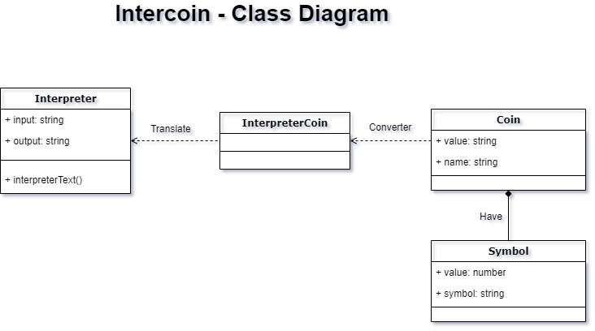

# Intercoin das Galáxias

_Trabalho para disciplina de Eng. de Software 2020/1 (UNIRITTER)_

Grupo: **Ana Luiza Mattos, Gabriel Wagner, Glaucus Rossini, Kathleen Alves e Matias Ücker**

Organização das Sprints: [Trello do Grupo](https://trello.com/b/3lWb5x3S/intercoin-das-gal%C3%A1xias)

## Sumário

* [Sobre o Projeto](#sobre_o_projeto)
* [Instalação](#instalação)
* [Diagrama de Classe do Projeto](#diagrama-de-classe-do-projeto)
* [Sobre o Tema do Trabalho](#sobre-o-tema-do-trabalho)

## Sobre o Projeto

Nosso projeto é uma aplicação em Angula e a proposta do professor não exigia criar banco de dados, servidor, ... E nem dividir em backend e frontend. A proposta era apresentar uma solução funcional, que fizesse o que foi pedido no [tema](#sobre-o-tema-do-trabalho), separando as tarefas em duas sprints e com divisão de tarefas para o grupo.

## Instalação
- Entrar na pasta application:

- Instalar o Node.js:

```bash
$ sudo apt install nodejs
```

- Se voçe não tiver o @angular-cli
```bash
$ npm install -g @angular/cli
```

- Instalar `Package.json`:

```bash
$ npm install
```

## Servidor de desenvolvimento

Rodar `ng serve` para servidor.
Navegue to `http://localhost:4200/`

## Rodar testes unitários

Rodar `ng test` para rodar testes unitários [Karma](https://karma-runner.github.io).

## Diagrama de Classes do Projeto

Primeira versão do diagrama de classes antes de rodar a primeira Sprint:



## Sobre o Tema do Trabalho
<details>
  
  Você decidiu desistir da Terra depois que o último colapso financeiro deixou 99,99% da população da Terra com 0,01% da riqueza. Felizmente, com a escassa soma de dinheiro que resta em sua conta, você pode alugar uma nave espacial, deixar a Terra e voar por toda a galáxia para vender metais e sujeira comuns em nosso planeta (que aparentemente valem muito em outros). Comprar e vender na galáxia exige que você converta números e unidades e então você decidiu escrever um programa para ajudá-lo. Os números usados ​​para transações intergalácticas seguem uma convenção semelhante aos números romanos e você coletou cuidadosamente a tradução apropriada entre eles. Os algarismos romanos são baseados em sete símbolos:

  Símbolo e Valor 
  I  1
  V 5
  X 10
  L 50
  C 100
  D 500
  M 1.000

  Os números são formados combinando símbolos e adicionando os valores. Por exemplo, o MMVI é 1000 + 1000 + 5 + 1 = 2006. Geralmente, os símbolos são colocados na ordem do valor, começando pelos maiores valores. Quando valores menores precedem valores maiores, os valores menores são subtraídos dos valores maiores e o resultado é adicionado ao total. Por exemplo MCMXLIV = 1000 + (1000 - 100) + (50 - 10) + (5 - 1) = 1944.

  Os símbolos "I", "X", "C" e "M" podem ser repetidos três vezes seguidas, mas não mais. (Eles podem aparecer quatro vezes se o terceiro e o quarto forem separados por um valor menor, como XXXIX.) "D", "L" e "V" nunca podem ser repetidos. "I" pode ser subtraído apenas de "V" e "X". "X" pode ser subtraído apenas de "L" e "C". "C" pode ser subtraído apenas de "D" e "M". "V", "L" e "D" nunca podem ser subtraídos. Somente um símbolo de pequeno valor pode ser subtraído de qualquer símbolo de grande valor.
  Um número escrito em [16] algarismos arábicos pode ser dividido em dígitos. Por exemplo, 1903 é composto por 1, 9, 0 e 3. Para escrever o numeral romano, cada um dos dígitos diferentes de zero deve ser tratado separadamente. No exemplo acima, 1.000 = M, 900 = CM e 3 = III. Portanto, 1903 = MCMIII.
  (Fonte: Wikipedia http://en.wikipedia.org/wiki/Roman_numerals) 

  A entrada para o seu programa consiste em linhas de texto detalhando suas anotações sobre a conversão entre unidades intergalácticas e algarismos romanos.
  Espera-se que você lide com consultas inválidas adequadamente.

  Entrada de teste:
  Dabu vale I 
  Swobu vale V 
  Lok'tar vale X 
  Mok'ra vale L

  Dabu Dabu prata vale 34 créditos 
  Dabu Swobu ouro vale 57800 Créditos 
  Lok'tar Lok'tar ferro vale 3910 Créditos

  Quanto vale Lok'tar Mok'ra Dabu Dabu? 
  Quantos créditos tem Dabu Swobu prata? 
  Quantos créditos tem Dabu Swobu ouro? 
  Quantos créditos tem Dabu Swobu ferro?

  Quanta madeira uma marmota poderia soltar se uma marmota poderia soltar madeira?


  Saída de teste:

  Lok'tar Mok'ra Dabu Dabu vale 42 
  Dabu Swobu prata vale 68 créditos 
  Dabu Swobu ouro vale 57800 Créditos 
  Dabu Swobu ferro vale 782 créditos 
  Eu não tenho ideia do que você está falando
</detail>
<p align="center">
  <h3 align="center">Test MiniNetflix</h3>
</p>

## About the project

This project aims to create an inspired by application on Netflix. This project was generated with [Angular CLI](https://github.com/angular/angular-cli) version 9.0.7.


### Installation
Enter the folderapplication

- Install Node.js:

```bash
$ sudo apt install nodejs
```

- If you don't have @angular-cli
```bash
$ npm install -g @angular/cli
```

- Install `Package.json` content:

```bash
$ npm install
```

### Development server

Run `ng serve` for a dev server.
Navigate to `http://localhost:4200/`

### Test users

Users to use the application

```bash
id: 1
name: Usuario 1 de teste
e-mail: testeum@teste.com
password: 123456
```

```bash
id: 2
name: Usuario 2 de teste
e-mail: testedois@teste.com
password: 123456
```

### Build

Run `ng build` to build the project. The build artifacts will be stored in the `dist/` directory. Use the `--prod` flag for a production build.

### Running unit tests

Run `ng test` to execute the unit tests via [Karma](https://karma-runner.github.io).

### Running end-to-end tests

Run `ng e2e` to execute the end-to-end tests via [Protractor](http://www.protractortest.org/).
